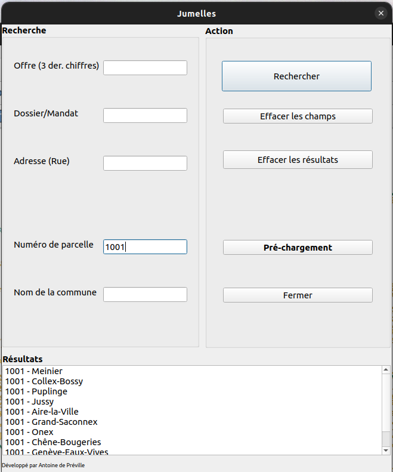

Jumelles plugin
========

# Introduction
The _Jumelles_ plugin (or _Binoculars_ in English) has been developed for a surveyor office in Geneva, Switzerland.

The plugin purpose is to look for places whose information whose code name is displayed in a widget and in the Geneva map. The sources are issued
internally and externally by the Geneva cadaster [SITG](https://map.sitg.ch/app/?mapresources=RDPPF).
It is a management tool.

# How does it work
The plugin works on a single window with:
* a research part on the left to search:
  * Offre
  * Dossier
  * Adresse
  * Parcelle
  * Commune
* an action part on the right with four buttons:
  * Rechercher
  * Effacer résultats
  * Fermer
  * Annuler
* a display field at the bottom that displays the code names of what we are looking for.
A double click on a result in the display field shows the place on the map and zooms in.

Here is a screenshot of the plugin:

It is important to note that at the first research, the plugin takes time to charge data.